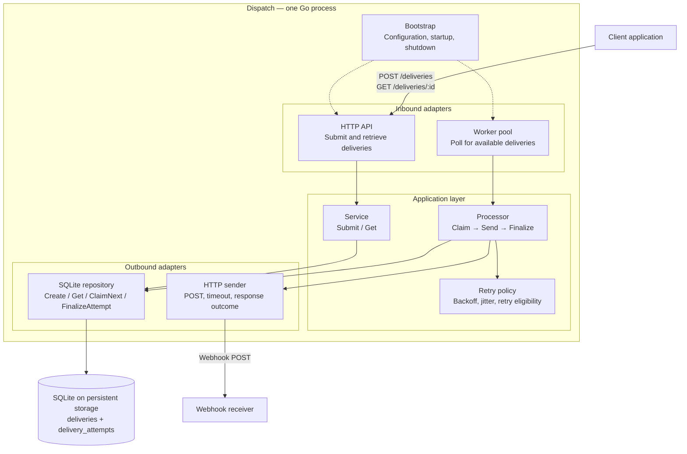
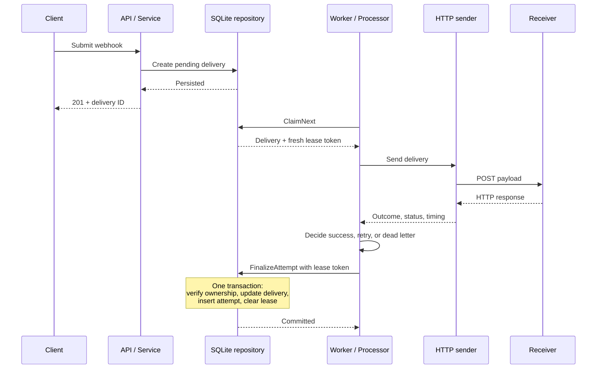
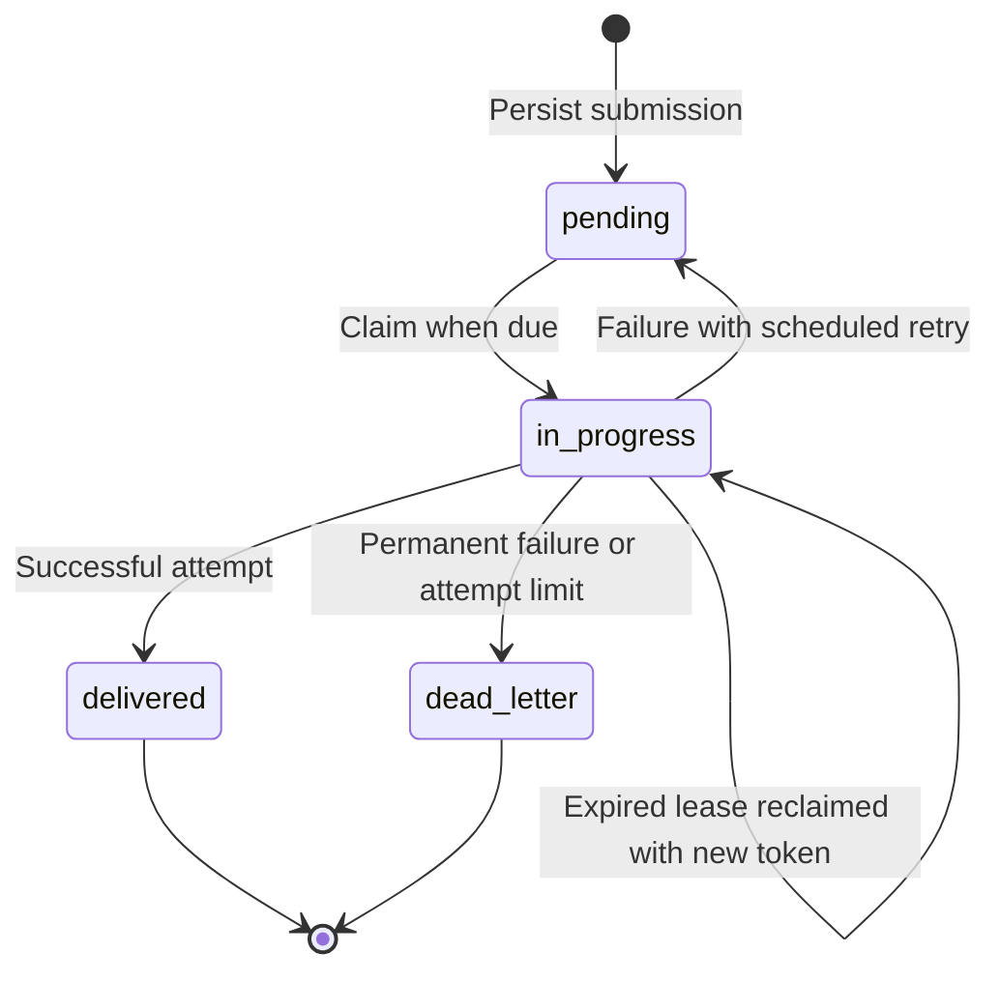

# Dispatch architecture

Updated: October 2, 2026.

Dispatch is a Go service that accepts webhook delivery requests, persists them
in SQLite, and processes them asynchronously. The target deployment runs the
HTTP API and background workers in one process, with SQLite on persistent storage.

The diagrams describe the target architecture. The implementation status below
distinguishes existing components from planned work.

## Overall architecture

The API acknowledges a submission after persistence. Workers pick it up
independently, so the client does not wait for the receiver.

The application layer depends on the `DeliveryRepository` and `Sender`
interfaces. Bootstrap injects their concrete implementations, keeping HTTP
and SQLite details out of the processing rules. The arrows above show runtime
interactions; application code depends on interfaces rather than adapters.

## Component responsibilities

| Component | Responsibility | Location |
|---|---|---|
| Bootstrap | Construct dependencies and coordinate startup and shutdown | `internal/bootstrap/` |
| HTTP API | Decode and validate requests; return delivery data and errors | `internal/adapters/inbound/httpapi/` |
| Service | Submit and retrieve deliveries | `internal/application/service.go` |
| Workers | Poll for work and invoke the processor with cancellation support | `internal/adapters/inbound/worker/` |
| Processor | Coordinate claiming, sending, retry decisions, and finalization | `internal/application/processor.go` |
| Retry policy | Decide retry eligibility and calculate the next attempt time | `internal/application/` (planned) |
| Repository | Persist deliveries, claim ownership, and finalize attempts atomically | `internal/adapters/outbound/sqlite/` |
| Sender | Perform an HTTP attempt and report its outcome | `internal/adapters/outbound/webhook/` |
| Domain | Define deliveries, attempts, and their states | `internal/domain/` |

Keep related methods, types, and tests in existing files. Split files when
their size or responsibilities make navigation harder, rather than creating
one file per operation.

## Delivery lifecycle

1. **Submit:** validate and persist a delivery as `pending`.
2. **Claim:** atomically select a due delivery or reclaim an expired lease;
   mark it `in_progress` with a fresh token.
3. **Send:** perform the outbound HTTP request outside a database transaction.
4. **Decide:** use the attempt outcome and retry policy to choose the next state.
5. **Finalize:** check ownership, increment the recorded attempt count, insert
   the completed attempt, update the delivery, and clear its lease in one
   transaction. Roll back all changes if either write fails.

## Delivery states

A delivery keeps the same ID across retries. An attempt represents one
outbound HTTP request. A dead letter is a delivery that will no longer be
retried under its configured policy.

## Ownership and delivery guarantees

Lease expiry makes a delivery eligible for reclaim. Replacing the lease token
revokes the previous worker's ownership. A late worker can still finalize if
its token remains current and the delivery is still `in_progress`.

- If the original worker finalizes first, a successful delivery becomes
  `delivered` and cannot be reclaimed.
- If another worker reclaims first, it replaces the token. Finalization by
  the original worker is rejected with `ErrLeaseLost`.
- Duplicate finalization cannot increment the attempt count twice because
  the first committed finalization clears ownership and changes the status.

The intended contract is at-least-once delivery within the configured retry
policy. Exhausted or permanent failures become dead letters. Duplicate sends
remain possible after crashes or ambiguous network failures. A planned stable
delivery identifier on outbound requests will let receivers deduplicate their
business operations atomically.

Currently, completed attempts are recorded after sending. A crash between
sending and finalization can leave an outbound request unrecorded. Recording
attempt starts and recovering interrupted attempts is separate future work;
the current `attempts_made` count represents recorded attempts.

## Storage and HTTP behavior

SQLite stores both the durable queue and attempt history:

- `deliveries`: request data, status, retry schedule, attempt count, and lease
  metadata.
- `delivery_attempts`: attempt number, timing, outcome, HTTP status, and error.

Database timestamps use UTC with nine fractional digits so text comparisons
preserve chronological order. Schema changes are applied through the existing
migration files.

The sender performs a POST with the stored payload and headers. Content-Type
defaults to `application/json`. It honors cancellation, uses a 10-second
timeout, disables redirects, and treats only 2xx responses as successful.
The processor must inspect the result's outcome even when the sender returns
no error. Response bodies are discarded with a bounded drain.

## Implementation status

Status as of October 2, 2026:

| Component | Current state |
|---|---|
| Submission and retrieval | Implemented |
| SQLite claim and finalization | Implemented |
| HTTP sender | Implemented |
| Worker polling loop | Implemented, not started by bootstrap |
| Processor orchestration | Skeleton; `ProcessNext` remains to be implemented |
| Retry policy | Not implemented |
| Worker pool and shutdown coordination | Not implemented |
| Persistent-path configuration, health checks, and metrics | Still needed |

The next milestone is `Processor.ProcessNext()`: connect claiming, sending,
retry decisions, and finalization. Then wire workers into bootstrap with
configuration and coordinated shutdown.

## Viewing the diagrams

Open this document in a Markdown viewer with Mermaid support, such as GitHub's
Markdown preview, to render the diagrams. Plain text viewers show their source.
